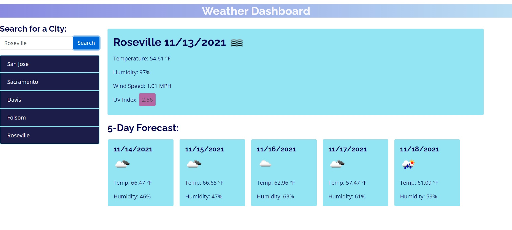

Links:

https://github.com/NedaParvini/Weather-controlPanel

https://nedaparvini.github.io/Weather-controlPanel

Process:

First, I went to the website they gave us to get the API key.
I wrote HTML codes for index page, created a form includes Search Button, Search box. 
Gave them Styles.

Then I defined variables, created a function to fetch the current condition of the weather first. I added the icon,Temperature, Humidity and Wind Speed I took them from Inspect,Console and tested them to get the right one

When I searched a City Name in the Search box it creates a city bar based on a Search and save it in the page, creats like a list.
And shows the five-day forecast.
For UV index when I view the UV index, I gave them colors based the condition which are favorable, moderate, or severe
0-2 green#3EA72D, 3-5 yellow#FFF300, 6-7 orange#F18B00, 8-10 red#E53210, 11+violet#B567A4 
I wrote 4 ifs and one else to check the condition and set the proper color.

I wrote another function for future condition and has two parameter which are Latitude (lat) and Longitude (lon)

For the date display, icon, temperature and humidity I set values and put all of them in the Function
I added Click event listener for entering city and save them in Local Storage as History.

Also, when I click a city in the Search history, I wanted to show the city's data again current and future.
When I refresh the page, I want to see the last searched city forecast so there is a function has to keep the last data and call it from local storage the last one in that array and show that in the page

Screenshot:

